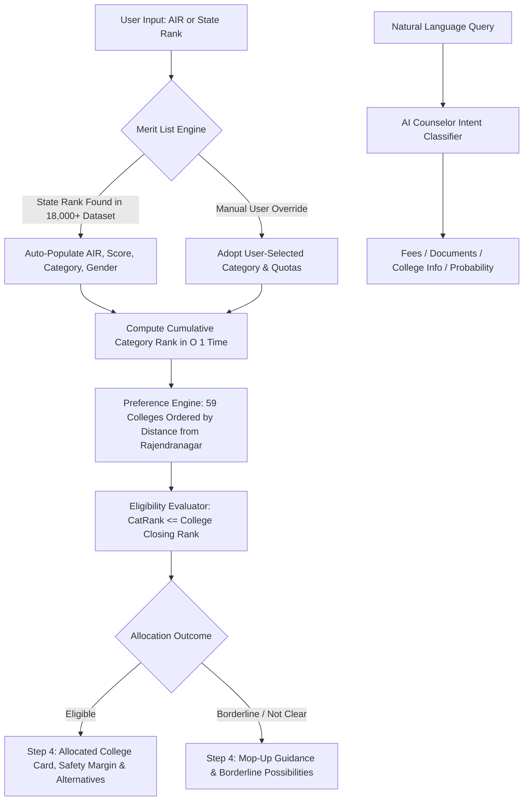

# Building mSeat: How We Engineered a 1-Click MBBS Mock Counselling Engine for 18,000+ Telangana NEET Aspirants

> **A Technical Case Study & Engineering Journey**  
> *How what started as a simple marks-to-rank estimator evolved into a full-scale discrete allocation simulator for 18,000+ medical aspirants competing for 6,000+ MBBS seats — and where we are heading next with Vercel, Gemini/ChatGPT, and Model Context Protocol (MCP).* 

---

## 1. Executive Summary & Genesis

Every year, over 2.2 million students across India appear for the NEET-UG examination. In Telangana, once the state merit list is announced by the state medical university (**KNRUHS**), over 18,000 qualified aspirants enter a high-stakes, confusing counselling process.

### The Problem We Set Out to Solve:
1. **Misleading Previous Year Cutoffs**: Students routinely rely on outdated closing rank spreadsheets or social media rumors that fail to account for:
   - **New NMC Seat Expansions**: Over **+460 MBBS seats** added in AY 2026-27 across Government & Private medical colleges.
   - **Complex Reservation Sub-Categorization**: Strict micro-allocation into **SC-1 (1%)**, **SC-2 (9%)**, and **SC-3 (5%)**, along with **ST (10%)**, **BC-A/B/C/D/E (29%)**, **EWS (10%)**, **85% Local vs 15% Unreserved Quotas**, and **33⅓% Women Horizontal reservation**.
2. **Analysis Paralysis & Cluttered Tools**: Existing counselling tools either hide behind expensive paywalls or force students to fill tedious 15-field forms before providing any meaningful answers.
3. **High Stress for Families**: Stressed students and parents wanted **one simple thing**: *"Given my AIR or State Rank, what college will I get right now?"*

**mSeat** was built with a clear mission: **Deliver instant, zero-friction, mathematically rigorous seat prediction in 1-Click directly in the browser.**

---

## 2. "We Thought It Was Easy" — The 1-Lakh Rank Reality Check

### Phase 1: The Disastrous Rank Predictor
When we first conceived mSeat, the plan was just to guess the rank. I built a rank predictor based on expected marks and last year's allotment cutoffs. Hearing that the paper was tough but biology was easy, I even added a "slider" to adjust predictions based on the complexity of the exam.

Then the actual results were announced. **It blew my mind. I was entirely wrong.** 

My rank prediction failed by a huge margin—around **1 lakh (100,000) ranks off** for my niece. The sheer inflation in scores destroyed all linear models.

### Phase 2: The "Reverse-Engineering" Flaw
Challenge accepted. I pivoted to predict *seat allotments*, thinking it would be easier. I took last year's seats, ranks, marks, and added the new seats for this year. I built the app. It looked good. 

But it was missing a massive flaw: **I had reverse-engineered the logic based on just one category.** When the engine applied that logic to other categories, it failed completely, giving probable eligibility for far more colleges than were actually possible. 

### Phase 3: The Complex Reality
I finally decided to adapt *all* categories, *all* sliding logics, and the *full* seat matrix. 
What I initially thought was a weekend project turned out to be tough. Very tough, and incredibly complex. 

The real allotment is governed by a **7-Dimensional Combinatorial Matrix**:
- Overall Statewide General Merit Rank (among 18,000+ peers).
- Micro-Category Quotas (SC-1/2/3, ST, BC-A/B/C/D/E, EWS, OC).
- 33.3% Horizontal Reservation for Women.
- 85% Local vs 15% Unreserved Domicile Quotas.
- Over 460+ newly added MBBS seats for 2026.

### The Unpredictable Variables
Even with all this logic, one part remains impossible to predict perfectly: human behavior. We cannot definitively guess how many top candidates will abandon state seats for **All India Quota (AIQ)** seats, or exactly how many top category candidates will occupy **Open Category (OC)** seats. 

But by utilizing the ultimate seat matrix and the final verified merit list, the app is now robust enough that it should mirror the official counselling very closely. Within the next week, we will see exactly how accurate this engine truly is!

---

## 3. End-to-End System Architecture Flowchart



---

## 4. Deep-Dive Engineering Challenges & Breakthroughs

### Challenge 1: The 18,000+ Candidate Matrix & O(1) Cumulative Rank Resolution
- **The Challenge**: In mock counselling, an applicant needs to know not just their General State Rank, but their **exact Category Rank** (*How many SC-2 or ST or BC-B candidates are ahead of me up to my serial number?*). Calculating this naively using loops on every input change caused UI stutter and sluggishness.
- **The Solution**: We built an in-memory cumulative counting index on page load. For any state rank position and category:
```
CategoryRank(StateRank, Category) = Count of all candidates up to StateRank in Category
```
This allowed any candidate looking up any State Rank to receive their exact category position across all 12 categories in **constant time O(1)**.

### Challenge 2: The Non-Monotonic Score Inversion Anomaly
- **The Problem**: During calibration, certain rank interpolations yielded inconsistent score outputs (e.g., estimating 392 marks instead of 393 marks for specific candidates).
- **Investigation**: In raw merit lists, candidates with special NCC or Sports bonus weightages appear out of natural score order (e.g., a candidate with bonus weightage appearing hundreds of ranks ahead of peers with identical raw scores). Naive linear interpolation between adjacent entries was corrupted by these outliers.
- **The Fix**: We implemented **median monotonic curve filtering**, grouping candidates by score and anchoring rank boundaries to the true statistical median of each score bracket. Direct lookups for known State Ranks bypass interpolation entirely to return the exact merit list score directly.

### Challenge 3: Balancing Auto-Detection with User "What-If" Overrides
- **The Problem**: When a user entered a State Rank, the engine auto-loaded their official category from the merit list. However, if an advanced user wanted to test a "what-if" scenario (e.g., simulating chances under ST or BC-B quota), an automated reload would overwrite their dropdown selection.
- **The Solution**: We engineered a **stateful priority hierarchy**:
  1. **Auto-Discovery by Default**: Entering a rank automatically detects the candidate's real profile.
  2. **User Explicit Override Tracker**: If the user touches or selects a custom option in the Advanced Panel, `userHasManuallyChangedCategory` flags true, locking the user's manual choice.
  3. **Multi-Category Cutoff Resolution**: When evaluating `runAllocation()`, the candidate's rank is evaluated against that specific category's cutoff curve across all 59 colleges.

### Challenge 4: Crushing a 5.8 MB Network Bottleneck to 545 KB
- **The Problem**: Serializing all 18,000+ candidate JSON objects created a `5.8 MB` JavaScript payload. Over mobile cellular networks and GitHub Pages, loading this external file caused a network race condition where the UI scripts executed before the dataset finished downloading, rendering the 1-Click button unresponsive.
- **The Solution**: We compressed the 18,000+ candidate dataset into a **compact array of primitives**:
```javascript
// Format: [stateRank, air, score, rawCategory, gender, isEWS]
const rawMeritData = [
  [1, 1420, 695, "OC", "M", 0],
  ...
  [8367, 289635, 393, "SC2", "F", 0],
  ...
  [18602, 1205432, 113, "BCB", "M", 0]
];
```
- **Payload Size**: Dropped from **5.8 MB** down to **545 KB** (**90.6% reduction**).
- **In-Memory Build Time**: Reconstructs the entire search dictionary in just **32.9 milliseconds** on page load.
- **Zero External Network Dependencies**: Embedded directly into the core bundle, making the app 100% offline-capable.

### Challenge 5: AI Counselor Intent Engine
- **The Problem**: Naive chat widgets often default to a single hardcoded response.
- **The Solution**: Built an intelligent client-side NLP intent router that dynamically categorizes queries:
  - **Fee Queries**: Renders complete AY 2026-27 Government vs Private fee tables.
  - **Document Checklist**: Provides the 11-point certificate verification guide.
  - **College Lookups & Head-to-Head Comparisons**: Generates comparative tables (distances, hospital beds, PG courses, closing cutoffs).
  - **Probability Assessments**: Activates predictive assessment only when marks or admission odds are explicitly asked.

### Challenge 6: UI Transformation — From Cluttered Form to 2026 GenZ SaaS
- **Zero-Friction 1-Click Hero**: Removed redundant score sliders and secondary fields from the main viewport. Kept only **NEET AIR** and **Telangana State Rank**.
- **Tactile Shimmer Button**: Styled with a diagonal animated light beam, cyan-to-emerald gradient, and multi-layer glow shadow.
- **Bento Card Architecture**: 3D obsidian bento cards with glowing focus rings on active inputs.
- **Collapsible Power Controls**: Tucked Category, Gender, Domicile, and PwD options into a clean accordion pill.
- **Seamless Aurora Mesh**: Removed flat top-bar borders, creating an immersive dark-mode backdrop that blends seamlessly from header to footer.

---

## 5. College Preference Hierarchy & Capacity Matrix

The engine pre-orders all Telangana medical colleges logically: **All 36 Government Colleges first**, followed by **all 23 Private Category-A Colleges**, ranked by travel distance from Rajendranagar, Hyderabad:

1. **Top Government Institutions (13 km – 20 km)**:
   - Osmania Medical College (`OMCH`, 13 km) — 250 Seats
   - Gandhi Medical College (`GAND`, 19 km) — 250 Seats
   - ESIC Medical College (`ESIM`, 20 km) — 150 Seats
2. **Hyderabad Peripheral & Suburban GMCs (32 km – 88 km)**:
   - GMC Maheshwaram, GMC Quthbullapur, GMC Sangareddy, GMC Vikarabad, GMC Yadadri, GMC Siddipet, GMC Mahabubnagar
3. **District Government Medical Colleges (100 km – 315 km)**:
   - Nalgonda, Suryapet, Jangaon, Wanaparthy, Nagarkurnool, Nizamabad, Karimnagar, Warangal, Khammam, Adilabad, Mulugu, Asifabad, Bhupalpally
4. **Top Private Medical Colleges (Cat-A Convenor Quota ₹60,000/yr)**:
   - Apollo Jubilee Hills, Kamineni LB Nagar, Bhaskar Moinabad, Mamata Bachupally, Patnam Mahender Chevella, Arundathi Dundigal, Maheshwara Patancheru, CMR Medchal, Mediciti Ghanpur, Chalmeda Karimnagar, Mamata Khammam

---

## 6. The AI Chatbot Failure & The Pivot to MCP

### 1. The Chatbot that Failed Miserably
I initially tried to build a direct chatbot inside the app to answer counselling queries. But honestly? It failed miserably at times. The logic of overlapping quotas, women's reservation, and regional mapping was simply too complex for a standard LLM to hold perfectly in its context window without hallucinating.

### 2. Pivoting to Model Context Protocol (MCP)
Instead of forcing a broken in-app chat, I shifted all my focus to building a **Model Context Protocol (MCP) Server**. 

By offloading the hard math to the MCP server, AI assistants (like Claude or Gemini) can now securely request the exact cutoffs and run discrete simulations *without* guessing.
- **The Achievement**: The MCP server now works flawlessly with **All India Rank (AIR)**. 
- **The Client App**: The web app functions reliably using either **All India Rank** or **State Serial Number**.

### 3. Advanced Customization
The beauty of this dual architecture is flexibility. For everyday students, the web app offers a clean 1-click interface. But for advanced users and developers, you can plug the MCP server directly into your own AI workflows and optimize the predictions exactly as per your specific needs.

---

## 7. Summary & Key Takeaways

```
+-------------------------------------------------------------------------------+
|                            WHAT WE LEARNED BUILDING MSEAT                     |
+-------------------------------------------------------------------------------+
| 1. Empathy Drives UX: Students in high-stress admission cycles do not want    |
|    complex forms. A clean 1-Click interface builds instant trust.             |
|                                                                               |
| 2. Client-Side Simulation is Powerful: Packing 18,000+ candidates into 545 KB |
|    gives users instant 30ms simulation with zero cloud server costs.          |
|                                                                               |
| 3. Data Integrity is Sacred: In medical admissions, a 1-mark discrepancy can  |
|    change a family's trajectory. Filtering outliers and verifying official    |
|    gazettes is essential.                                                     |
+-------------------------------------------------------------------------------+
```

---

*mSeat is built with pure Vanilla JavaScript (ES6+), HTML5, and CSS3 Glassmorphism.*  
*Live Application: [mseat.kprsnt.in](https://mseat.kprsnt.in)*  
*GitHub Repository: [github.com/kprsnt2/mSeat](https://github.com/kprsnt2/mSeat)*